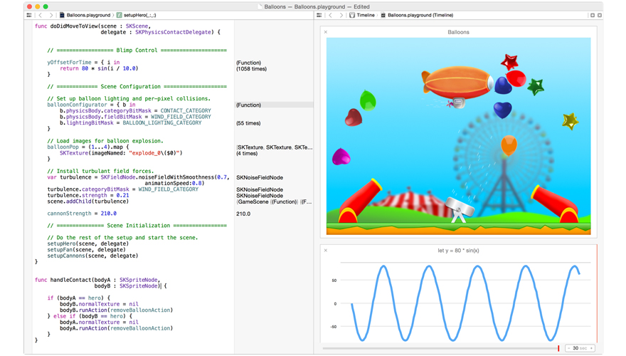

> 关于翻译本书的缘由，请看[这里](why_this_project/README.html)。

> [这里](http://beyondvincent.gitbooks.io/the-swift-programming-language-chinese-bv-version/)有本书在 GitBook 上面的地址。

---

##The Swift Programming Language 中文破船版


####<center>Swift 介绍</center>

> 本节[苹果官方原文](https://developer.apple.com/swift/)

Swift 是一门新的具有创造性的编程语言,可用于 Cocoa 和 Cocoa Touch。利用 Swift 编写的代码充满了交互性和乐趣性，它的语法简洁并富有表现力，开发出的应用程序运行速度快如闪电。Swift 已经为你准备好开发下一个 iOS 和 OS X 项目了 — 当然也可以在当前的项目中使用 — 因为 Swift 代码可以与 Objective-C 齐驾并驱。

<center>[从 iBooks Store 中可以下载到 "The Swift Programming Language" >](https://itunes.apple.com/us/book/the-swift-programming-language/id881256329?mt=11)</center>



---

####现代 (Modern)

Swift 是苹果最近研发出来的编程语言，它整合了苹果数十年的相关经验。借鉴于 Objective-C 的参数命名方式(语法非常干净和清晰)，使得 Swift  APIs 非常易读和维护。

```swift
var sortedStrings = sorted(stringArray) {
    $0.uppercaseString < $1.uppercaseString
}
```

Swift 的类型推测 (inferred types) 使代码更加干净，并且不易出错而模块 (modules) 消除了头文件的引入，并提供了相关的命名空间。它的内存是被自动管理的，另外在每行代码的尾部的分号也不是必须的。

Swift 还有许多其它功能让你的代码更富有表现力：
* 闭包的统一与函数指针
* 元祖 (tuples) 和多个返回值
* 泛型 (generics)
* 在一个范围或者集合上快速并简洁的迭代
* 结构体支持方法、扩展和协议
* 函数式编程模型。例如 map 和 filter

####交互式的 Playgrounds

Playgrounds 使得编写 Swift 代码变得非常的简单和有趣。输入一行代码，马上就能看到结果。如果代码运行了一段时间，例如一个循环，我们可以在时间轴上看到运行的过程。时间轴以图表的形式显示变量，当构建一个 view 时，会绘制出每一个阶段，可以播放一个 SpriteKit 场景动画。当你要在 playground 中执行代码时，简单的将代码搬到工程中即可。 下面一些场景中，结合 playgrounds 会非常有效：

* 设计新的算法时，观察每一步的执行结果
* 创建新的测试 case，用以验证之前做的测试项
* 实验新的 APIs，来提高你的 Swift 编程技巧

####Read-Eval-Print-Loop (REPL)

在 Xcode 的调试控制台中内置了一个 Swift 语言的交互版本。利用 Swift 语法，可以与正在运行的程序进行交互和验证，或者在一个脚本似的交互环境中写新的代码，并观察它是如何工作的。可以在 Xcode 的控制台 (console) 或者终端 (terminal) 中体验。

####安全性设计

Swift 去掉了不安全的代码。变量在使用之前总是被初始化，会对数组和字典(注意: 此处官方原文是 integers，但是译者认为应该是 dictionary)做溢出检查，另外内存是自动管理的。调整后的语法可以更加容易编写代码 — 例如，简单的 3 个字符关键字就能定义一个**变量 (var)** 或 **常量 (let)**

Swift 中的安全模式专门针对 Cocoa 和 Cocoa Touch APIs 做了调整。众所周知，当对象是 **nil** 时，理解并作出恰当的处理是非常基础并重要的。添加一个字符就能替换 Objective-C 中的整行代码。上面这些功能结合起来可以更加容易和安全的构建 iOS 和 Mac 程序。

####快速且强大

Swift 的初衷就是要快速。使用高性能的 LLVM 编译器，Swift 代码被转换为最优的本地 (native) 代码，并调整了以充分利用现代的 Mac，iPhone 和 iPad 硬件。语法和相关的标准库也做出了相应的调整。

Swift 是 C 和 Objective-C 语言的继任者。它包括一些基本的编程用法，例如类型，流程控制和操作符。同时还提供了面向对象的功能，例如类，协议和泛型，满足 Cocoa 和 Cocoa Touch 开发者需要的性能和效率。

####准备就绪

开发者可以马上在程序中利用 Swift 代码实现新功能，当然也可以在已有的程序中。在同一个工程中，新写的 Swift 代码可以与已有的 Objective-C 代码文件共存。今年秋季 iOS 8 和 OS X Yosemite 发布时，开发者就可以将用 Swift 编写的程序提交到 App Store 和 Mac App Store 中。

